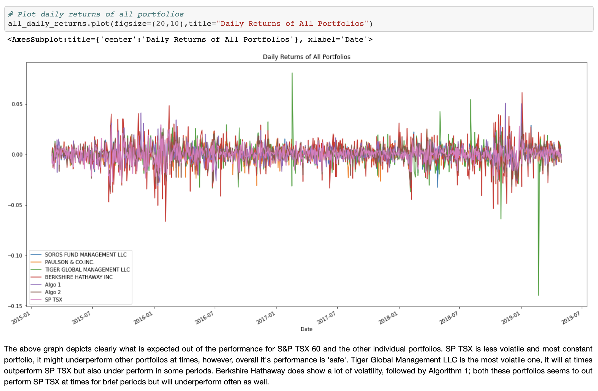
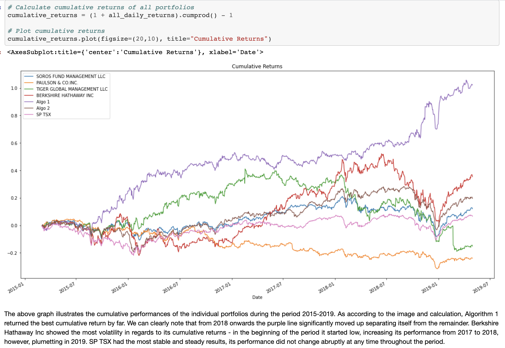
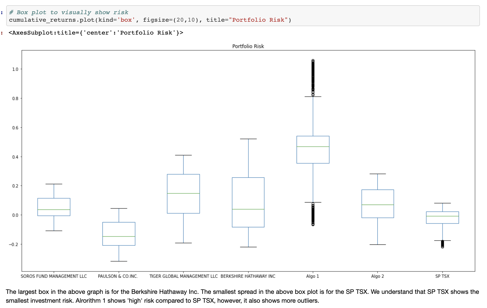
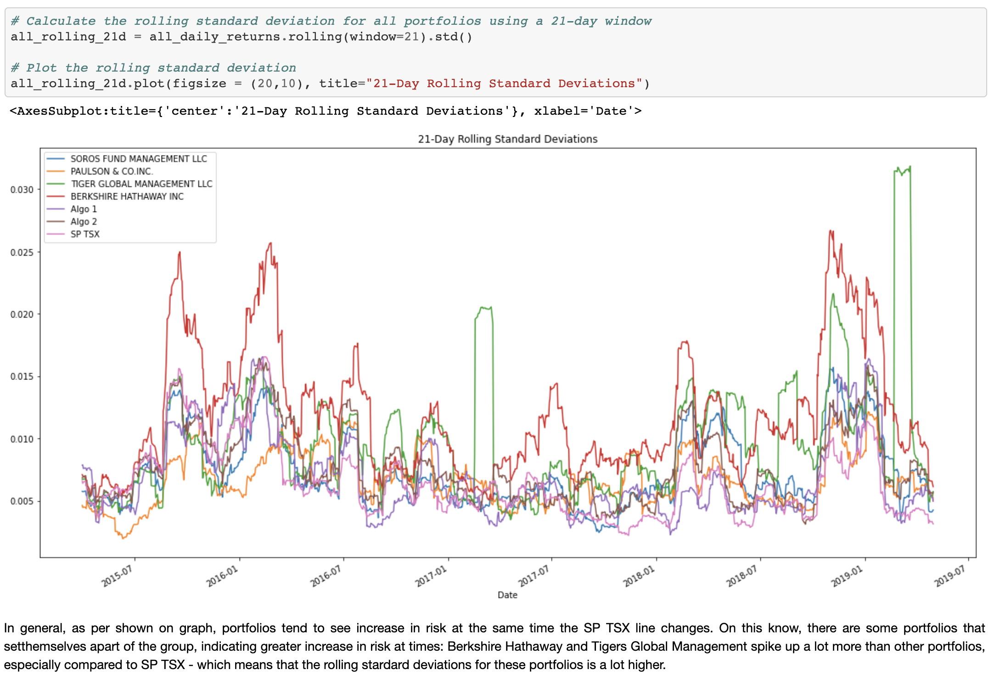
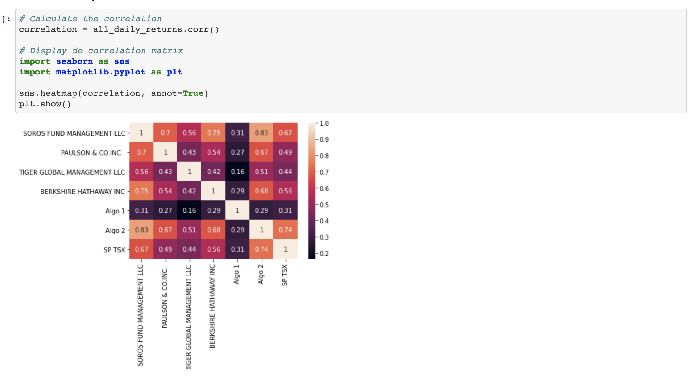
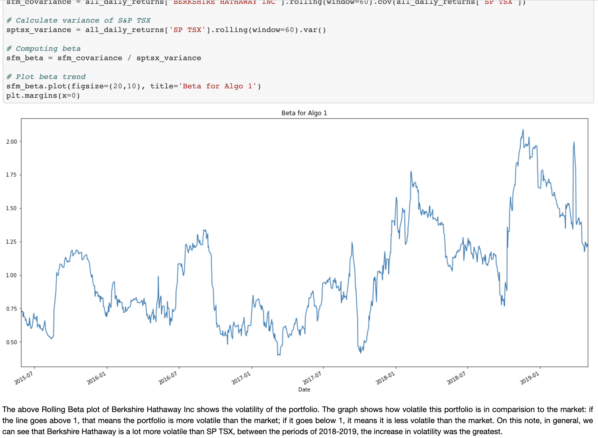
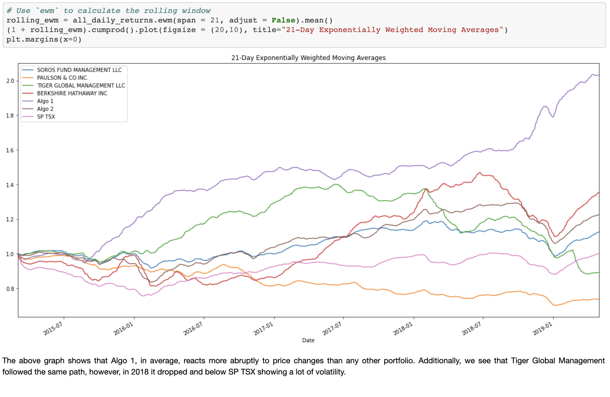
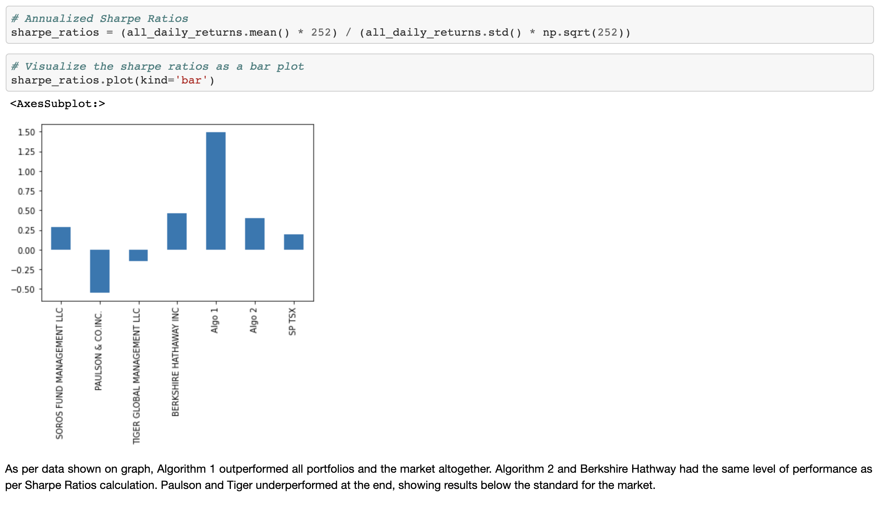

# Pandas Project - Portfolio Analysis: a deep analysis of Management firms vs the S&P TSX 60.

This project used quantitative analysis to review the performance of different investment portolios against the S&P TSX. Data based on a 4-year timefram from 2015-2016 was analysed using Python/Pandas. The metrics used was Sharpe ratios (risk-to-reward), returns, beta and other volatility metrics.

## Looking into the project:

While the S&P TSX Data was still 'raw' and needed work done. The CSV for Algorithm and Whale_Portolios was already clean and had the returns calculated. On this note, I had to calculate the returns for SP TSX using pc_change(). Additionally, after making sure the data was good to be analyzed, I concatenated the portfolios to make it easier to analyse it.

### Performance analysis.

Daily Returns

Cumulative Returns

Risk Analysis

21-day rolling standard deviation

Correlation

Beta

Exponentially Weighted Average

Sharpe Ratios

